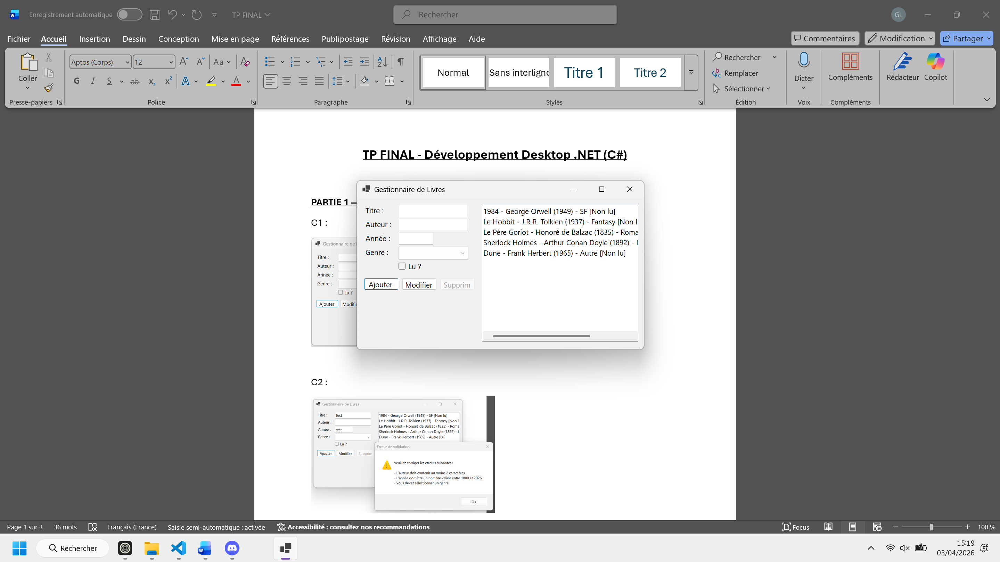
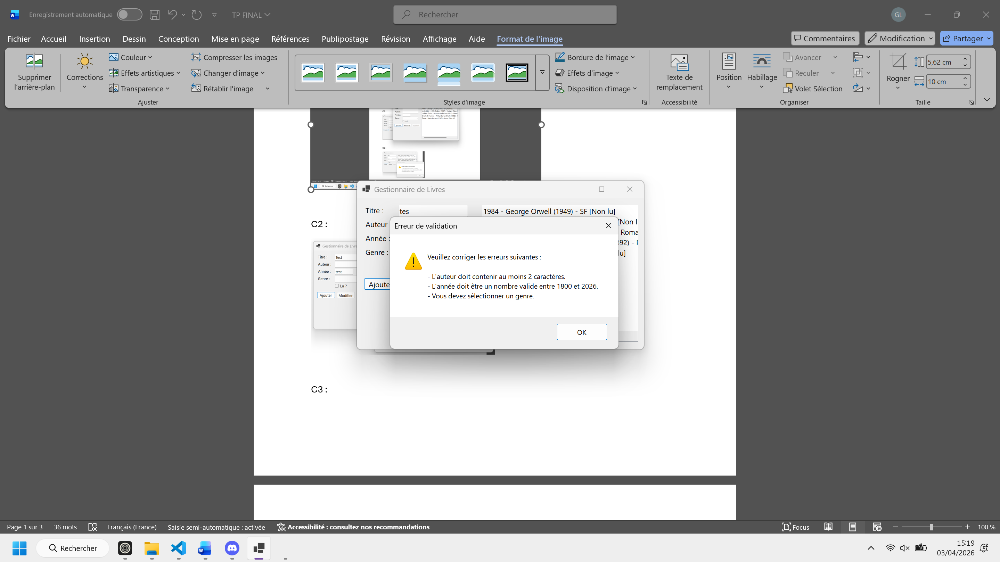
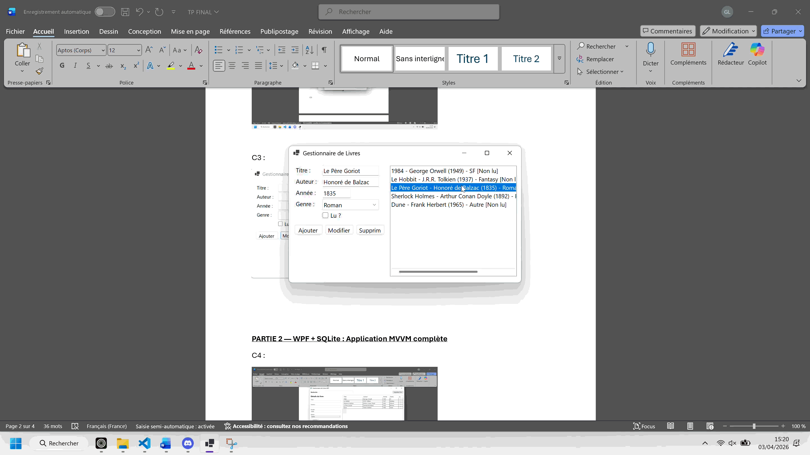
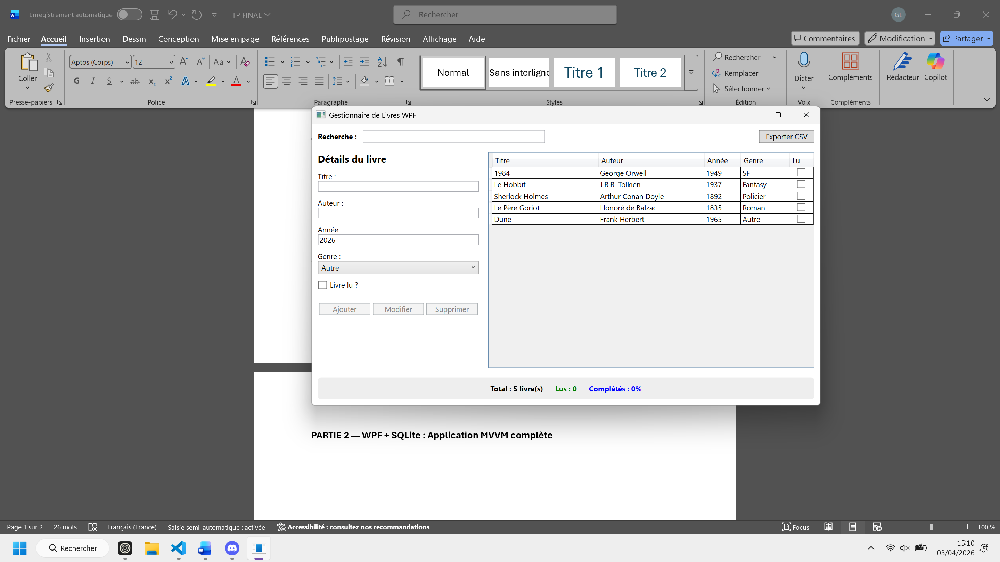
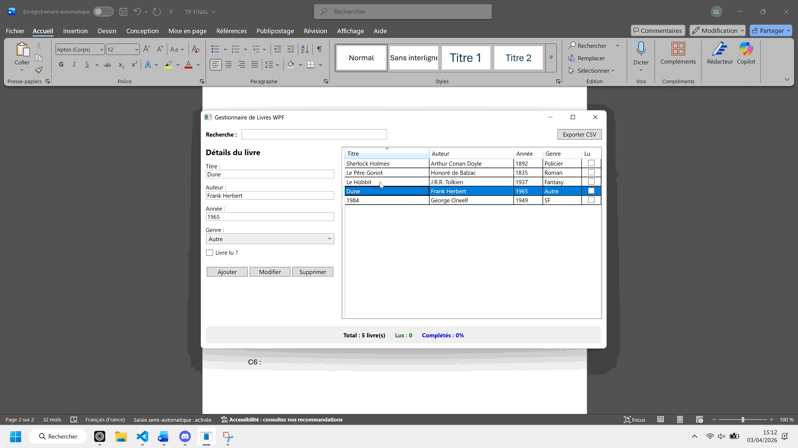
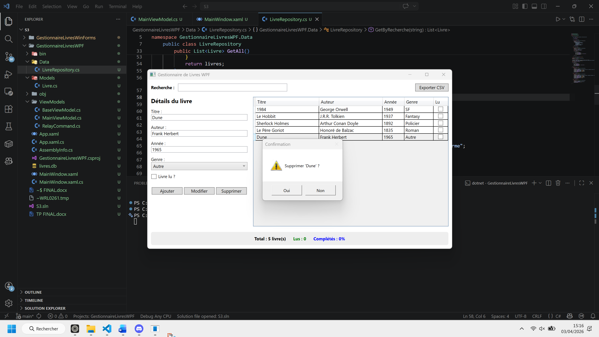
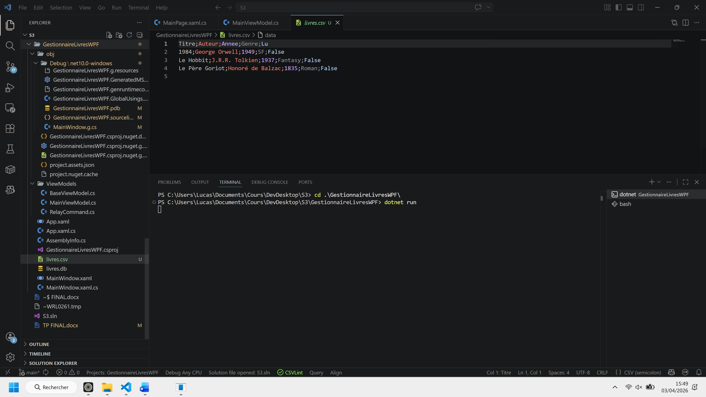

# TP FINAL - Développement Desktop .NET (C\#)

## Lucas GERARD


---

Pour cloner ton dépôt et te placer immédiatement dans le dossier racine du projet, utilise ces deux commandes dans ton terminal :
```bash
# 1. Cloner le dépôt
git clone https://github.com/LucasGYnov/TP_FINAL_Dev_Desktop.git

# 2. Entrer dans le dossier
cd TP_FINAL_Dev_Desktop
```

## Instructions de lancement
Pour exécuter les différents projets de cette solution, assurez-vous de posséder le **SDK .NET 10.0**[cite: 10]. Ouvrez un terminal à la racine de la solution et utilisez les commandes suivantes :
### 1\. Partie WinForms
```bash
cd GestionnaireLivresWinForms
dotnet run
```
### 2\. Partie WPF (Architecture MVVM & SQLite)

```bash
cd GestionnaireLivresWPF
dotnet run
```
### 3\. Partie MAUI (Multi-plateforme)

```bash
cd GestionnaireLivresMAUI
dotnet run -f net10.0-windows10.0.19041.0
```

---

## PARTIE 1 — WinForms

**C1 :**

*Mini-description : Interface principale créée entièrement par code affichant la liste des livres et les contrôles de gestion.*

**C2 :**
*Mini-description : Validation stricte affichant un MessageBox regroupant toutes les erreurs de saisie (titre, auteur, année, genre).*

**C3 :**
*Mini-description : Mode édition activé par double-clic, pré-remplissant le formulaire avec les données du livre sélectionné.*

-----

## PARTIE 2 — WPF + SQLite : Application MVVM complète

**C4 :**
*Mini-description : Vue principale WPF sous pattern MVVM incluant le panneau de statistiques dynamiques et le bouton d'export.*

**C5 :**
*Mini-description : Système de recherche en temps réel filtrant la liste instantanément lors de la saisie (ex: "fan").*

**C6 :**
*Mini-description : Formulaire de modification synchronisé avec l'élément sélectionné dans le DataGrid.*

**C7 :**
*Mini-description : Fenêtre de confirmation de sécurité avant la suppression d'une entrée dans la base SQLite.*

**C8 :**
*Mini-description : Démonstration de la persistance des données après redémarrage de l'application.*

-----

## PARTIE 3 — MAUI : Application mobile-ready

**C9 :**
*Mini-description : Interface multi-plateforme avec CollectionView, badges de couleurs par genre et filtre des livres lus.*

-----

## PARTIE 4 — Bonus

**Réponse Q1 :** Les termes manquants pour la classe RelayCommand sont : **ICommand**, **execute**, **true**, **CanExecuteChanged**.

**Réponse Q2 :** La fonctionnalité d'export CSV est intégrée au projet WPF, permettant de sauvegarder la liste au format `Titre;Auteur;Annee;Genre;Lu`.

**C10 :**
*Mini-description : Aperçu du fichier "livres.csv" généré avec le séparateur point-virgule dans le dossier de l'application.*
